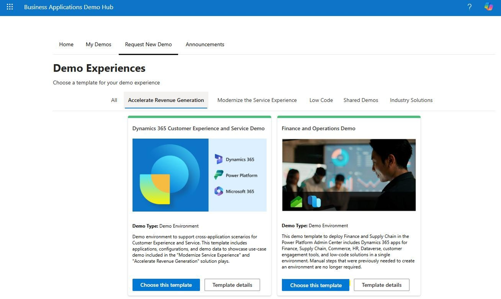
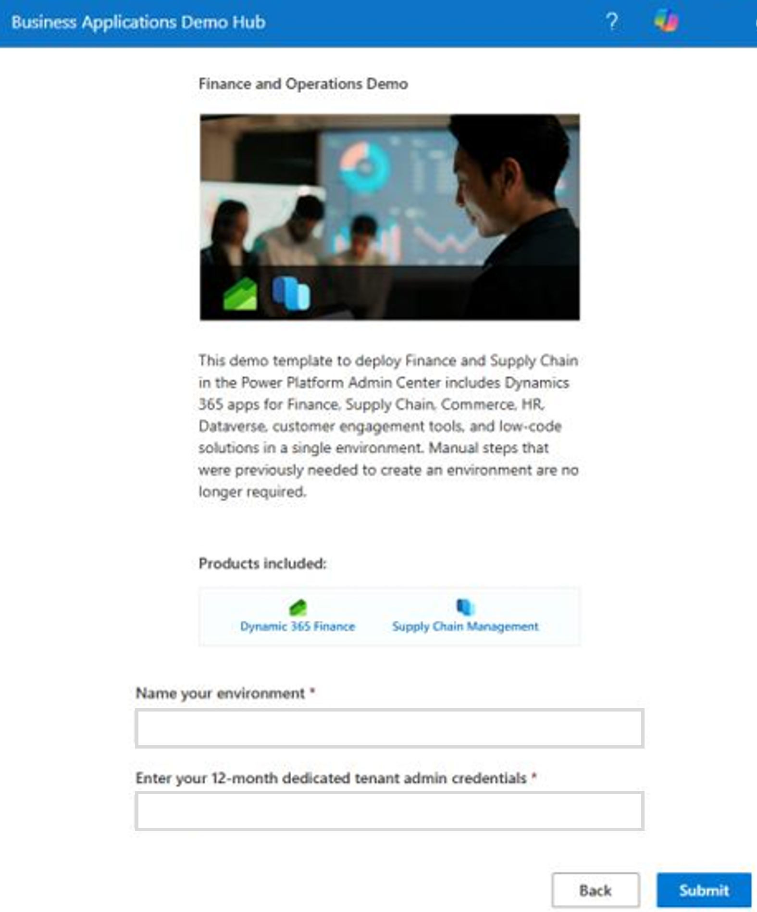
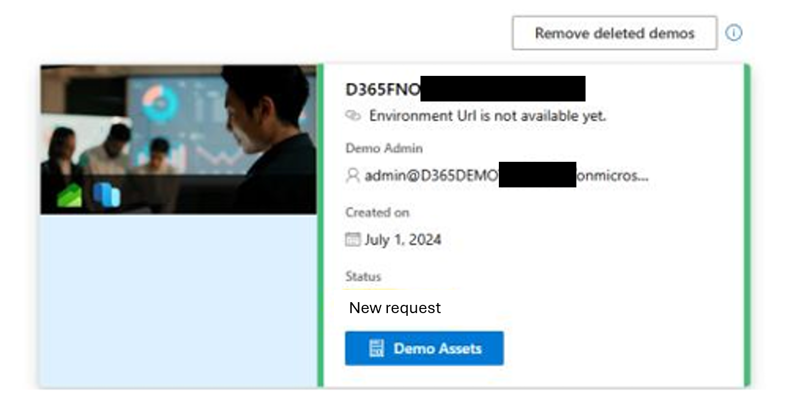

# Task 01: Request a Finance and Operations Demo environment
<!-- Estimated duration 5 minutes-->

## Introduction
You already have a demo environment. Now you need to add a Finance and Operations Demo environment so that you can showcase the AI agents to your customers.

## Description

In this task, you request a **Finance and Operations Demo** environment.

## Success criteria

- You've access to a **Finance and Operations Demo** environment in your Demo environment.
- You can access and sign in to resources in the environment.

## Learning resources

- [Business Applications Demo Hub](https://bizappsdemos.microsoft.com/newdemorequest?category=accelerate+revenue+generation "Business Applications Demo Hub")

## Key tasks

### 01: Request a Finance and Operations Demo environment

1. Open a browser and go to [Business Applications Demo Hub](https://bizappsdemos.microsoft.com/newdemorequest?category=accelerate+revenue+generation)

1. Sign in by using the admin credentials for your demo environment.

1. Select the **Finance and Operations Demo** tile, and then select **Choose this template**.

    

1. In the **Name your environment field**, enter a unique name for the demo environment. 

1. Sign in to the demo environment by using the admin credentials for your demo environment and then select **Submit**.

    

1. Note that the value of the **Status** field updates to **New request**.

    

1. Wait for an email announcement that the environment is deployed. 

    {: .warning }
    > During recent testing, we observed that the deployment process takes longer than three hours.

1. Return to the **Business Applications Demo Hub** page and verify that the environment is listed as **Ready**.

