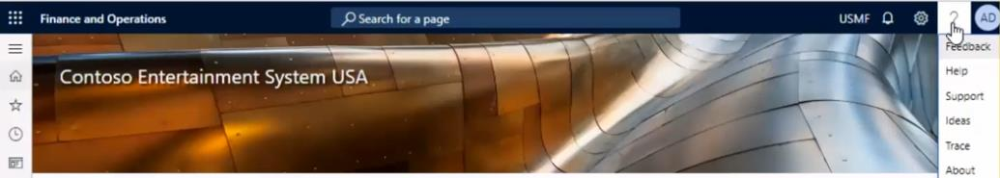
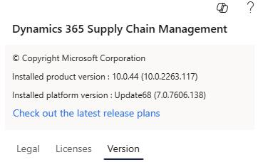

# Task 02: Confirm that the environment meets the minimum version requirement
<!-- Estimated duration 5 minutes-->

## Introduction
The various finance and operations agents all require that the environment is version 10.0.44 or later. When you provision demo environments this requirement should be met. Customers often hold off on upgrading systems for various reasons. You need to check to see what version your customer is running.

## Description

In this task, you'll check to confirm that the environment meets the minimum version requirement.

## Success criteria

- The environment is version 10.0.44 or later.

## Key tasks

### 01: Confirm that the environment meets the minimum version requirement

1. Sign in to the **Finance and Operations** app by using the admin credentials for your demo environment.

1. At the upper right of the page, select **Help** (**?**).

1. Select **About**.

    

1. In the **Application version** field, verify that the version is 10.0.44 or later.

    
