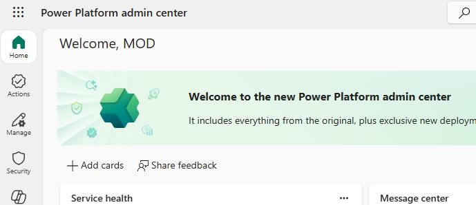
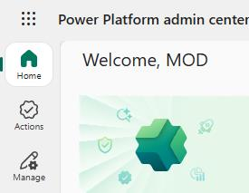
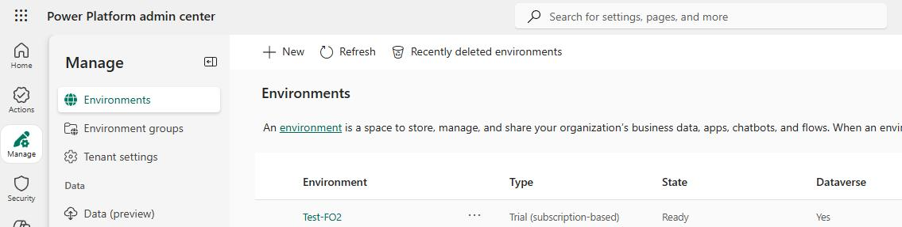
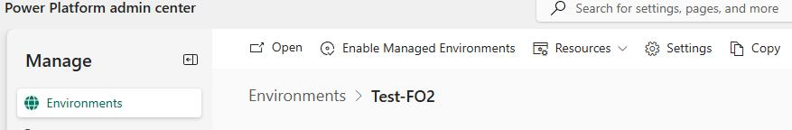
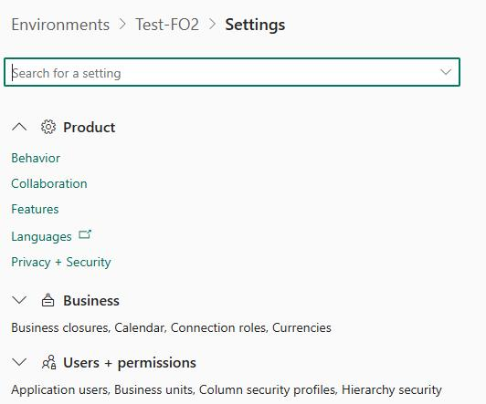
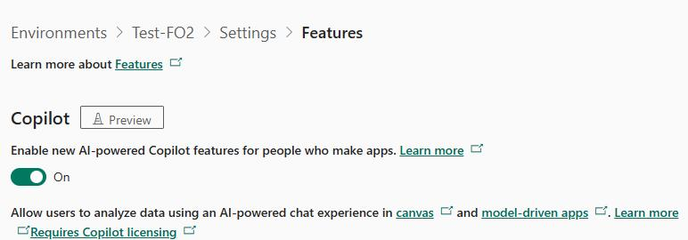
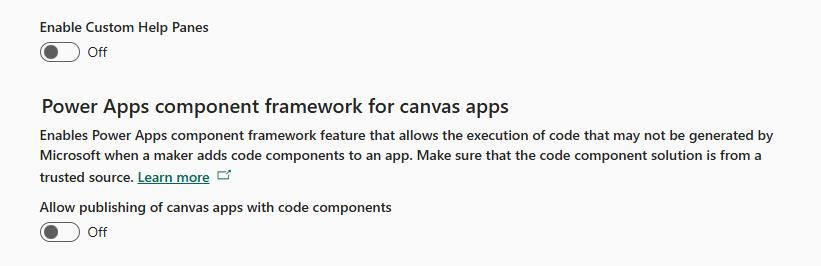
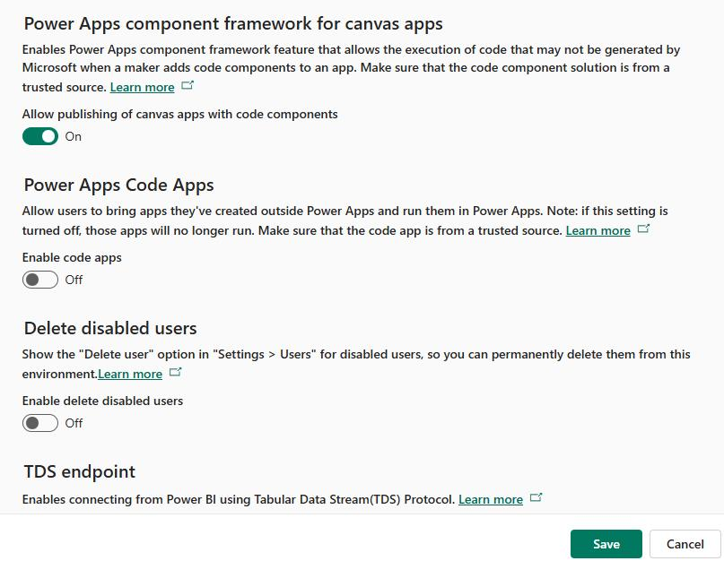

# Task 01: Configure resources in Power Platform admin center
<!-- Estimated duration 5 minutes-->

## Introduction
The demo environment that you requested included finance and operations components and Power Platform. To configure agents later in the lab, you need to know some information about the Power Platform environment that was provisioned. This includes the name, ID, and URL.

You need to enable specific features in the environment to allow the agents to operate correctly. 

## Description

In this task, you'll collect identifying information about the environment for use later in the lab. you'll also enable features in the environment. 

## Success criteria

- You've recorded the ID and URL for the environment
- You've enabled required features

## Learning resources
- [Manage feature settings](https://learn.microsoft.com/en-us/power-platform/admin/settings-features?WT.mc_id=ppac_inproduct_settings&tabs=new "Manage feature settings")

## Key tasks

### 01: Record information about your environment for use later in the lab

1. Open a browser tab and go to the [Power Platform](https://admin.powerplatform.microsoft.com/).

1. Sign in by using the credentials for your demo environment.

    

1. In the left pane, select **Manage**. 

    

1. Paste the name for your demo environment into a Notepad file, for later.

    {: .note }
    > Adding the name here allows you to retrieve it for other steps in the instructions as needed.

1. In the list of environments, select the **current** environment. 

    

1. On the details page for the environment, in the **Details** section, copy and paste the values for the following parameters into your notepad file:

    - **Environment URL**: @lab.TextBox(EnvURL)
    - **Organization ID**: @lab.TextBox(OrgID) 
    - **Finance and Operations URL**: @lab.TextBox(OrgURL) 
    - **Environment ID**: @lab.TextBox(EnvID)

1. Leave the Power Platform admin center open. You'll use the admin center again in part 02 of this task, which follows.

### 02: Enable features in the environment

1. On the menu bar for the **Environment** page, select **Settings**.

    

1. Expand the **Product** node and then select **Features**.

    

1. On the **Features** page, set **Copilot** to **On**.

    

1. Set **Power Apps component framework for canvas apps** to **On**.

    {: .note }
    > You may need to move down the page to locate this setting.

    

1. At the lower right of the **Features** page, select **Save**.

    

1. Leave the Power Platform admin center open. you'll use the admin center again in the next task.