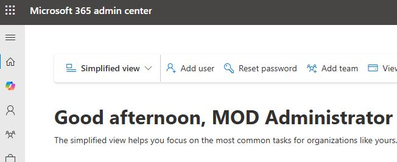
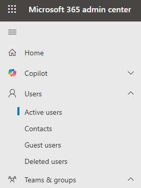
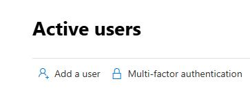
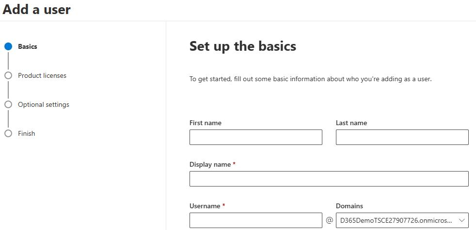
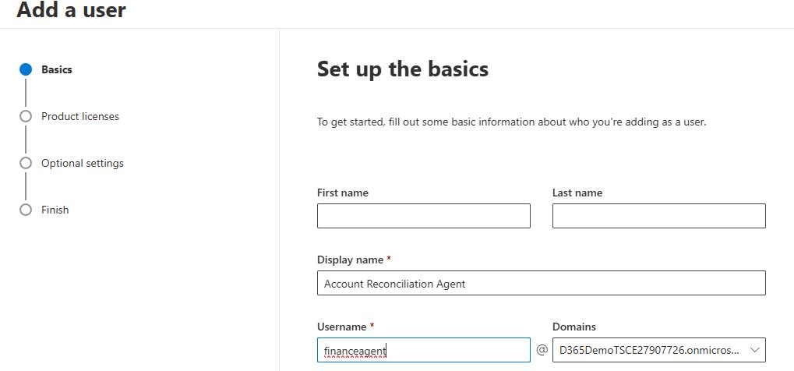
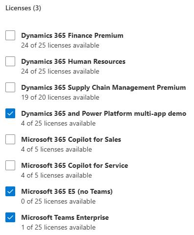

# Task 01: Create identities (user accounts) for agents

## Introduction
For demonstration purposes you can run the agents under your admin account. However, customers and partners may decide to use separate identities for each agent. 

You only need to create the identities once on your environment. Then, you can use the identities across environments.

## Description

In this task, you'll create identities for each of the following agents:

- Account Reconciliation
- Expense
- Supplier Communications
- Time

## Success criteria

- You've created the required identities
- You've assigned the required licenses to each identity

## Key tasks

### 01: Create identities (user accounts) for agents
1. In the virtual machine, open a browser tab and go to the [M365 Admin Center](https://admin.microsoft.com).

1. If prompted, sign in by using the admin credentials for your demo environment.

    

1. In the left pane, select **Users** and then select **Active Users**.

    

1. On the **Active users** page, select **Add a user**.

    

1. Copy the value from the **Domains** field and paste the value into the following text field. 

    <!--
    **Domain**: @lab.TextBox(Domain) -->

    {: .note }
    > The domain should resemble **D365DemoTSCE########.onmicrosoft.com**. 
    >
    > This value will be used later in the lab to dynamically create email addresses.

    

1. In the **Display name** field, enter **Account Reconciliation Agent**.

1. In the **Username** field, enter **financeagent**.

    

1. Clear the **Automatically create a password** and **Require this user to change their password...** checkboxes. 

1. [] In the **Password** field, enter `ILIke@gents`. 

    

1. Select **Next**.

1. Assign the following licenses:

    -  **Dynamics 365 and Power Platform multi-app demo**.
    -  **Microsoft 365 E5 (no Teams)**
    -  **Microsoft Teams Enterprise**

    

    {: .warning }
    > The demo environment provisions a specific number of user accounts and assigns licenses to the various accounts. When you attempt to assign licenses in this step, you may find that there are no licenses available. 
    >
    > If this situation occurs, remove licenses from other users as needed.

1. Select **Next**.

1. On the **Optional settings** page, expand **Profile info**.

1. In the **Mobile phone** field, enter your mobile phone number.

    {: .warning }
    > It important that you use your mobile phone number for each of the identities that you create in this task. Later in the lab you'll need to sign in by using these identities. Adding your mobile phone number allows you to use multi-factor authentication (MFA) during sign in.

1. Select **Next** and then select **Finish adding**.

1. Repeat steps 4-8 to create the following additional identities:

    | Display name | UserName | 
    |:---------|:---------|
    | Approvals Agent   | approvalsagent  | 
    | Expense Agent   | expenseagent  | 
    | Supplier Communications Agent   | supplieragent  |
    | Time Agent   | timeagent  | 

    {: .warning }
    > Please note that you must assign each of the three licenses to all five identities.

1. Leave the Microsoft 365 admin center page open. you'll perform additional steps in the admin center in the next task.