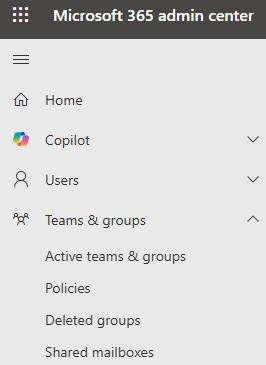
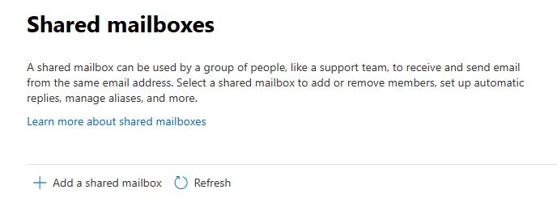
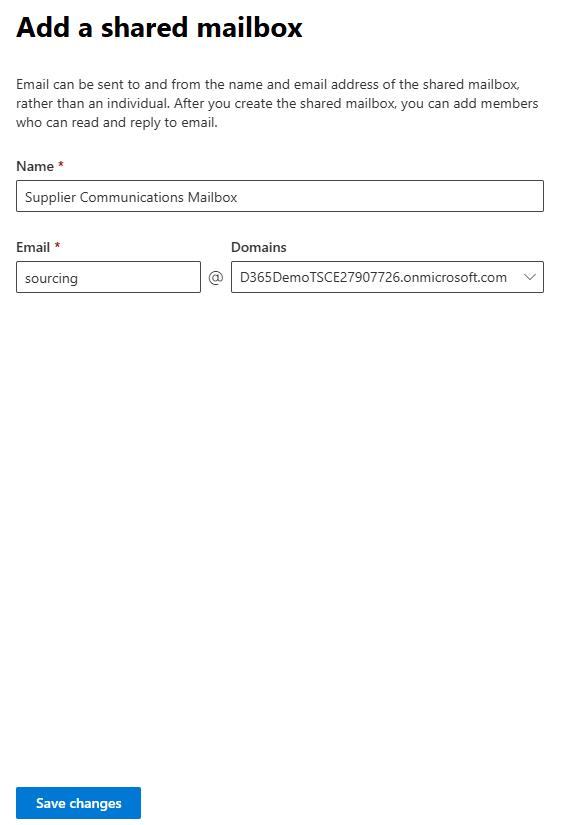
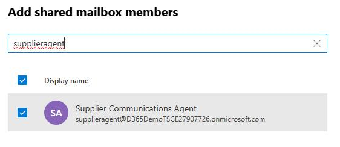
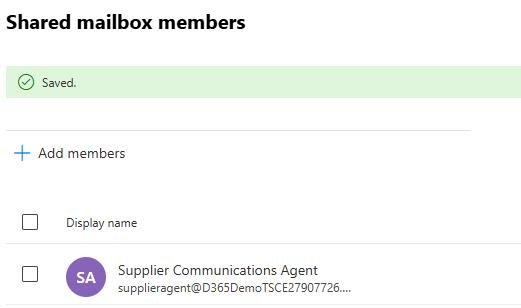

# Task 02: Create shared mailboxes for agents
<!-- Estimated duration 7 minutes-->

## Introduction
You need to create mailboxes to support the Supplier Communications agent and the Expense agent. 

## Description

In this task, you'll create two shared mailboxes.

## Success criteria

- The mailboxes are created

## Learning resources

- [Create a shared mailbox](https://learn.microsoft.com/en-us/microsoft-365/admin/email/create-a-shared-mailbox?view=o365-worldwide "Create a shared mailbox")

## Key tasks

### 01: Create shared mailboxes for agents

1. In a browser tab, go to the [M365 Admin portal](https://admin.microsoft.com). 

1. Sign in by using the admin credentials for your demo environment.

1. In the left pane, expand **Teams & groups** and then select **Shared mailboxes**.

    

1. Select **+ Add a shared mailbox**.

    

1. In the **Name** field, enter **Supplier Communications Mailbox**.

1. In the **Email** field, enter **sourcing**and then select **Save changes**.

    

1. In the **Your shared mailbox was created** pane, select **Add members to your shared mailbox** and then select **+ Add members**.

    

    

1. In the **Search** field, enter **supplieragent** and select the entry in the search results.

    

1. Select **Add**.

    

1. Wait for the members to be added.

    

1. Repeat steps 4-10 to create a shared mailbox for the Expense agent. Use the following values:

    | Field | Value | 
    |:---------|:---------|
    | Name   | **Expenses Mailbox**  |
    | Email   | **expenses**  |
    | Member to Search for   | **expenseagent**  |
