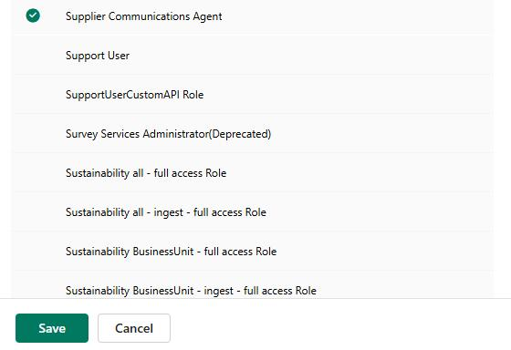
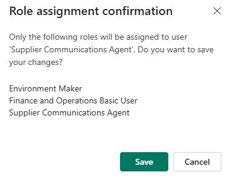

# Task 01: Assign roles to the agent identity

## Introduction
Earlier in the lab you created an identity for the Supplier Communications agent. Now, you'll assign the roles required to support the agent.

## Description

In this task, you'll add the **supplieragent** identity to resources and then assign roles.

## Learning resources

- [Set up and configure the Supplier Communications Agent (production ready preview)](https://learn.microsoft.com/en-us/dynamics365/supply-chain/procurement/supplier-com-agent-setup?source=recommendations "Set up and configure the Supplier Communications Agent (production ready preview)")

## Success criteria

- The required identities and roles are assigned.

## Key tasks

### 01: Import the agent identity as a user and assign a role

1. In **Finance and Operations**, go to **System Administration** and select **Users**. 

    

1. On the menu bar, select **Import users**.

    

1. In the **Import users** pane, scroll through the list of users. Locate and select **Supplier Communications Agent**, and then select **Import users**.

    

1. Close the confirmation dialog.

1. In the list of users, locate and select **supplieragent**.

1. On the **User** page, in the **User's roles** section, select **+ Assign roles**.

1. In the **Assign roles to user** pane, select **(Preview) Supplier Communications Agent**  and then select **OK**.

    

### 02: Add the **supplieragent** identity to the Power Platform admin center and assign roles

1. Open a browser tab and go to the [Power Platform](https://admin.powerplatform.microsoft.com/).

1. Sign in by using the credentials for your demo environment.

    
    
1. In the left pane, select **Manage**. 

    

1. In the list of environments, select the **@lab.Variable(EnvName)** environment. 

    

1. On the **Access** tile, select **Users** and then select **See all**.

    

1. Select **+ Add user**.

    

1. In the **Add user** pane, search for and select +++**supplieragent@lab.Variable(Domain)**+++. Then, select **Add**.

1. On the **Manage security roles** pane, select the following three roles and then select **Save**:

    - Environment Maker
    - Finance and Operations Basic User
    - Supplier Communications Agent

    
    
    

1. In the **Role assignment confirmation** dialog, select **Save**.

    