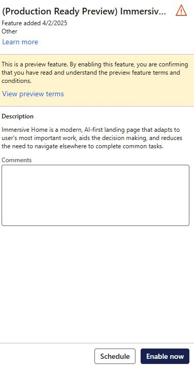
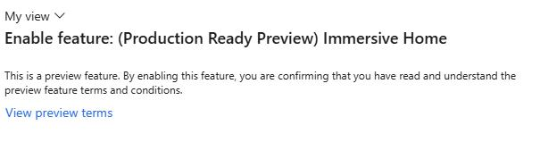
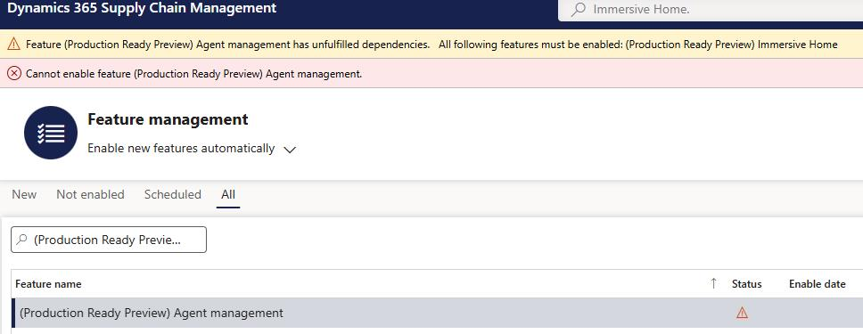

# Task 02: Enable required finance and operations features
<!-- Estimated duration 7 minutes-->

## Introduction
The Supplier Communications agent integrates with a variety of other resources and services. You need to ensure that features required by the agent are enabled.

## Description
In this task, you'll enable the features that are required to support the Supplier Communications agent.

## Learning resources
- [Immersive Home overview (production ready preview)](https://learn.microsoft.com/en-us/dynamics365/fin-ops-core/fin-ops/copilot/immersive-home "Immersive Home overview (production ready preview)")

## Success criteria
The following features are enabled:

- (Production ready preview) Immersive Home
- (Production Ready Preview) Agent management
- (Production Ready Preview) Supplier Communications Agent
- (Production Ready Preview) Send follow-up emails to vendors with Supplier Communications Agent - automatically sending emails

## Key tasks
### 01: Enable required finance and operations features
1. In **Finance and Operations**, go to the **Feature management** workspace.

    

2. On the menu bar, select **Not enabled**.

3. In the **Filter** field, enter **(Production ready preview) Immersive Home**

    {: .note }
    > It's important that you search for the entire name (including parentheses) or the tool may not find the feature.

    

4. In the **(Production ready preview) Immersive Home** pane, select **Enable now**.

    

5. In the **Enable feature** pane, select **Enable**.

    

    

6. Repeat steps 3 - 5 to add the following features. 

    {: .warning }
    > It's important that you enable each feature in the order presented.
    >
    > As you attempt to enable new features, you may see a message that resembles the following screenshot. 
    >
    > The message indicates that the feature which you previously enabled is not quite ready yet.
    >
    > 

    - **(Production Ready Preview) Agent management**
    - **(Production Ready Preview) Supplier Communications Agent**
    - **(Production Ready Preview) Send follow-up emails to vendors with Supplier Communications Agent - automatically sending emails**

