# Task 03: Configure the shared mailbox
<!-- Estimated duration 10 minutes-->

## Introduction
The Supplier Communications agent analyzes email messages on your behalf. To use the agent, you must set up targeted mailboxes that are synchronized with Dataverse at the server level.

## Description

In this task, you configure a shared mailbox for the agent to use.

## Success criteria

- The mailbox is configured

## Learning resources
- [Synchronize mailboxes with Dataverse](https://learn.microsoft.com/en-us/dynamics365/supply-chain/procurement/supplier-com-agent-setup?source=recommendations#synchronize-mailboxes-with-dataverse "Synchronize mailboxes with Dataverse")

## Key tasks

### 01: Create the team

1. In the virtual machine, open a browser tab and go to [Power Platform](https://admin.powerplatform.microsoft.com/).

1. Sign in by using the admin credentials for your demo environment.

    
    
3. In the left pane, select **Manage**. 

    

1. In the list of environments, select the **@lab.Variable(EnvName)** environment. 

    

1. On the details page for the environment, on the menu bar, select **Settings**.

    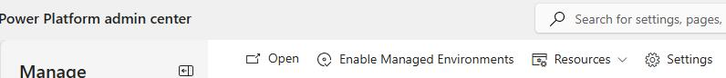

1. Expand **Users + permissions** and then select **Teams**.

    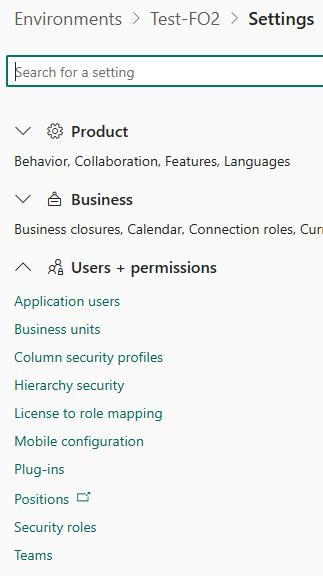

1. Select **Create team**.

    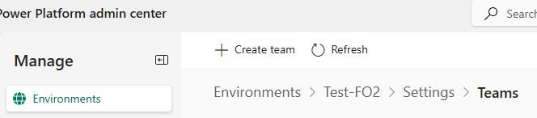

1. In the **New team** pane, configure the team by using the values in the table below.

    | Field | Value | 
    |:---------|:---------|
    | Name | **Sourcing Team** |
    | Business unit | @lab.Variable(EnvName) |
    | Administrator | Select your admin account |
    | Team type | **Owner** |

    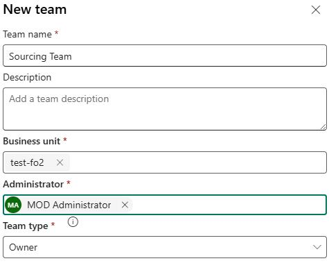

1. Select **Next** twice.

1. On the **Manage security roles** pane, select the following two roles and then select **Save**:

    - Basic user
    - Finance and Operations Basic User
 
    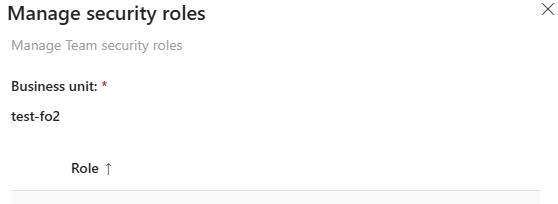

    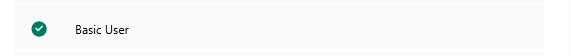

    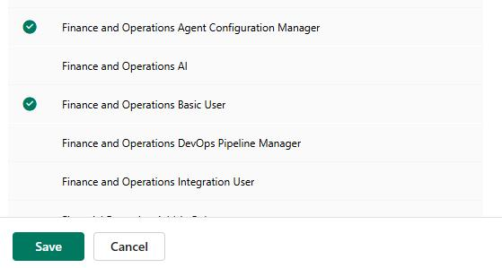

1. In the **Role assignment confirmation** dialog, select **Save**.

    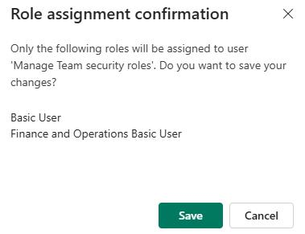

1. Leave the Power Platform admin center open. you'll use the admin center again in part 02 of this task, which follows.

### 02: Create the queue

1. Open a browser tab and go to [Power Platform](https://admin.powerplatform.microsoft.com/).

1. Sign in by using the admin credentials for your demo environment.

    
    
1. In the left pane, select **Manage**. 

    

1. In the list of environments, select the **@lab.Variable(EnvName)** environment. 

    

1. On the details page for the environment, on the menu bar, select **Settings**.

    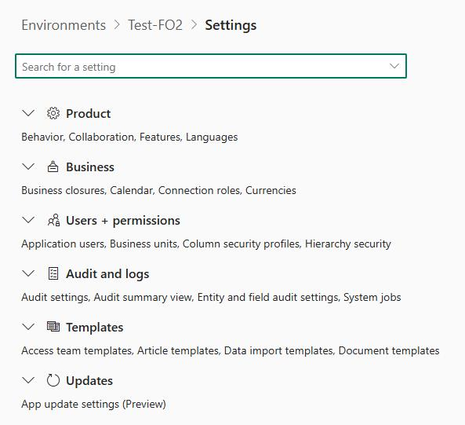

1. Expand **Business** and then select **Queues**.

    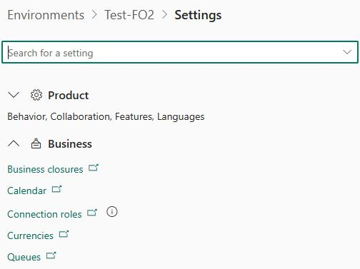

1. If prompted, sign in by using the admin credentials for your demo environment.

1. Select **+ New**.

1. Configure the queue by using the values in the table below:
    
    | Field | Value | 
    |:---------|:---------|
    | Name | **+Sourcing Queue** |
    | Incoming email | **sourcing@lab.Variable(Domain)** |
    | Owner | **Sourcing Team** |

    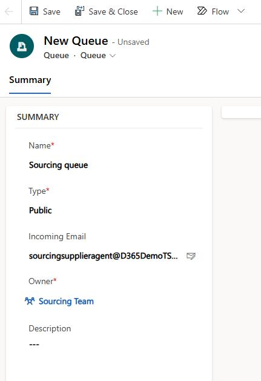

1. Select **Save**.

1. Leave the **Queues** page open. you'll use the page again in part 03 of this task, which follows.

### 03: Test and enable the mailbox

1. In the list of queues, locate and select the **Sourcing queue**.

    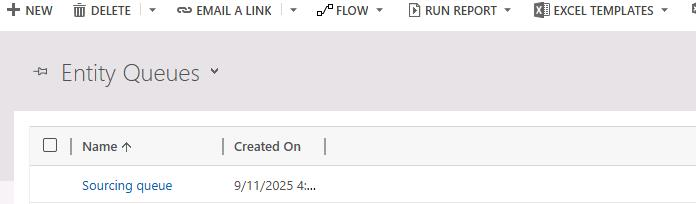

1. On the **Sourcing queue** page, on the menu bar, select **Open Mailbox**.

    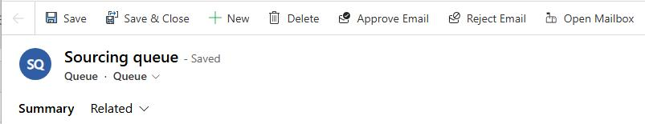

1. On the **Mailbox** page, on the menu bar, select **Test & Enable Mailboxes**.

    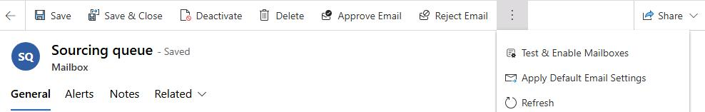

1. In the confirmation dialog, select **OK**.

    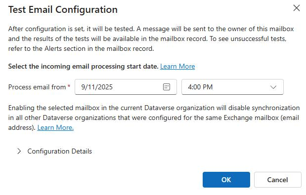
    
    {: .note }
    > At this point, the email configuration test is scheduled. Wait for the test to run or come back to check results.
    >
    > Refresh the page occasionally to check for updates. After the test completes, check to ensure that the Status for both incoming and outgoing emails is **Success**.

    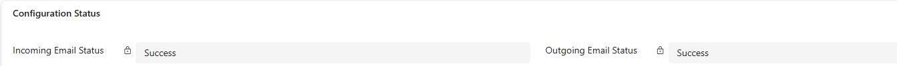