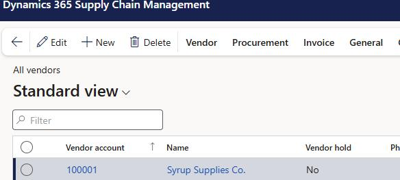
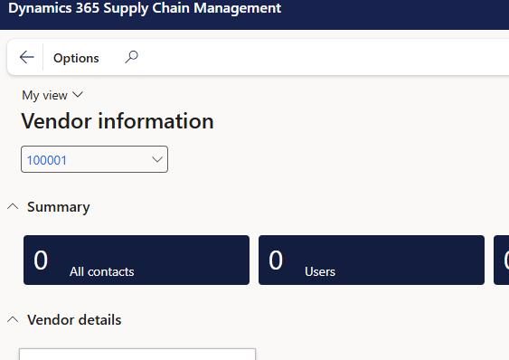
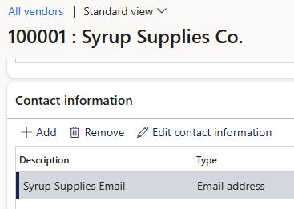

# Task 05: Link an email address to a vendor
<!-- Estimated duration 5 minutes-->

## Introduction

To perform the demo you'll need to send emails from an external email account (such as your @microsoft.com address) acting as a vendor sending purchase order changes or confirmations.    
## Description

In this task, you'll link the external email account you'll be using to a selected vendor. 

## Success criteria

- You receive an email from SAP that includes the URI and credentials to access the SAP Gateway Demo system.
- You successfully connect to the AP Gateway Demo system. 

## Key tasks

1. In **Finance and Operations**, switch to company **COCO** (Contoso Coffee).
 
1. Search for and select **All Vendors**.

    

1. Search for and select vendor **100001: Syrup Supplies Co**.

    

1. Move down to the **Contact information** section and select **+ Add**.

    

1. onfigure the new contact by using the information in the following table and then, on the menu bar, select **Save**.

    | Field | Value |
    |:---------|:---------|
    | Description | **Delivery updates**   |
    | Type   | **Email address**  |
    | Contact number/address   | Add an email address of your choosing  |