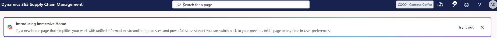
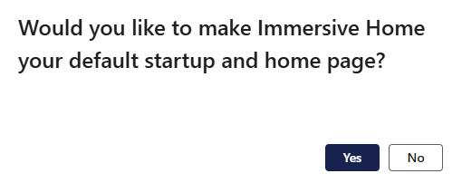
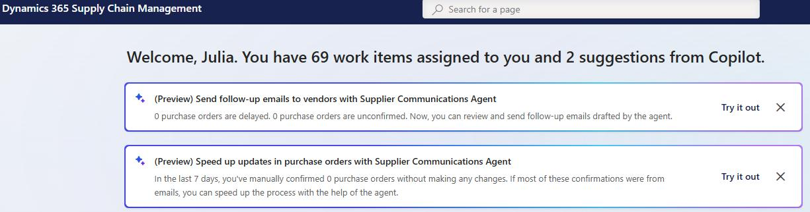
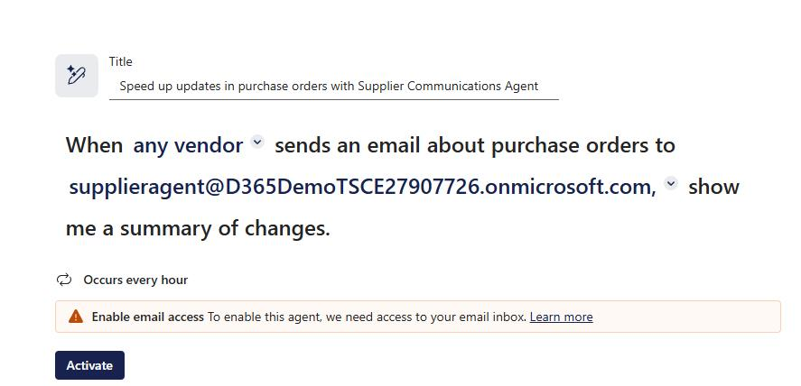

# Task 06: Configure and activate the agent
<!-- Estimated duration 10 minutes-->
## Introduction
The final steps for configuring the agent are to set up inbound and outbound processes.
  
## Description

In this task, you configure inbound and outbound communication processes for the agent.

## Success criteria

- The Supplier Communications agent is active.

## Key tasks

### 01: Activate inbound processes

### 01: Link an email address to a vendor

1. On the **Finance and Operations** home page, in the **Introducing Immersive Home** banner that displays at the top of the page, select **Try it out**. 

    

1. In the confirmation dialog, select **Yes** and then select **Get started**.

    
    
1. At the top of the new Home page, in the **(Preview) Speed up updates in purchase orders...** banner, select **Try it out**.

    

1. In the configuration pane, select the dropdown arrow next to the email address and then select **supplieragent*@lab.Variable(Domain)**.

1. Select **Activate**.

### 02: Activate outbound processes

1. At the top of the new Home page, in the **(Preview) Send follow-up emails to vendors...** banner, select **Try it out**.

    

1. In the configuration pane, modify the options to meet your needs and then select **Activate**.

### 03: Test the agent
To test the agent, see [Source to Pay Demo Script](http://aka.ms/SourceToPayDemoScript "Source to Pay Demo Script") for an in depth scenario that you can demonstrate with your customers.

