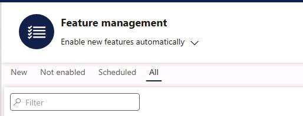
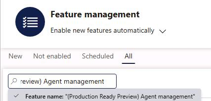
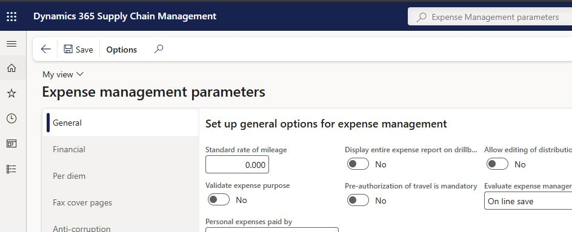
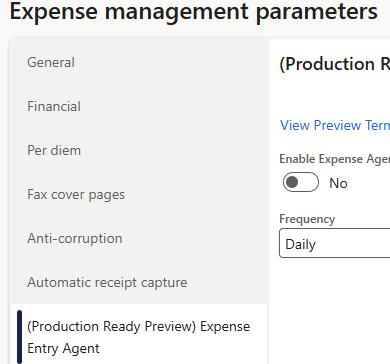
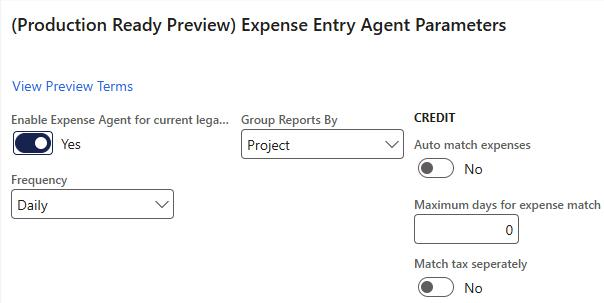
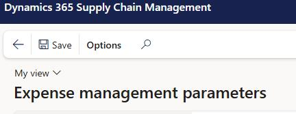

# Task 01: Configure resources in the finance and operations environment
<!-- Estimated duration 5 minutes-->

## Introduction
The Expense agent requires that specific features including Immersive Home are enabled. You enabled some features earlier in the lab when you configured the Supplier Communications agent. Now, you need to verify that the features are enabled.

You must also configure the finance and operations Expense Mananagement feature to support the agent.

## Description
In this task, you'll verify that required Finance and Operations app features are enabled. You'll also configure the Expense Management feature.

## Success criteria
- The Immersive Home and Agent Management features are enabled
- The Expense Management feature is configured

## Learning resources
- [Set up the Expense agent](https://learn.microsoft.com/en-us/dynamics365/project-operations/expense/expense-agent-setup#option-a-use-a-powershell-script-recommended)

## Key tasks

### 01: Enable features in the Feature Management workspace

1. In **Finance and Operations**, go to the **Feature management workspace**.

    

1. On the menu bar, select **All**.

    

1. In the **Filter** field, enter **(Production ready preview) Immersive Home**+ and select **Enter**.

    {: .note }
    > It's important that you search for the entire name (including parentheses) or the tool may not find the feature.

    

1. Verify that the **Status** column displays a check mark (**&#10003;**). 

    {: .note }
    > The check mark indicates that the feature is enabled.

    

1. In the **Filter** field, enter **(Production Ready Preview) Agent management** and then select **Enter**.

    

1. Verify that the **Status** column displays a check mark (**&#10003;**). 

    

### 02: Configure the Expense agent

1. In **Finance and Operations**, go to **Expense Management**, select **Setup**, select **General**, and then select **Expense Management parameters**.

    

1. In the left pane, select **(Production Ready Preview) Expense Entry Agent **.

    

1. Configure the agent parameters by using the values in the following table:

    | Parameter | Value |
    |:---------|:---------|
    | Enable Expense Agent for current legal entity  | **Yes**   |
    | Frequency   | **Daily**   |
    | Group Reports By   | **Project**   |

    

1. On the menu bar, select **Save**.

    