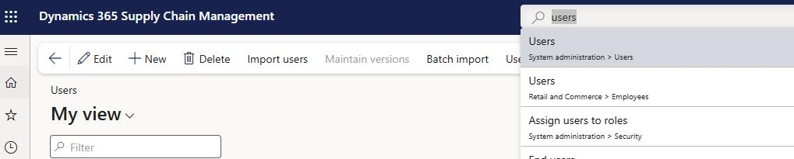
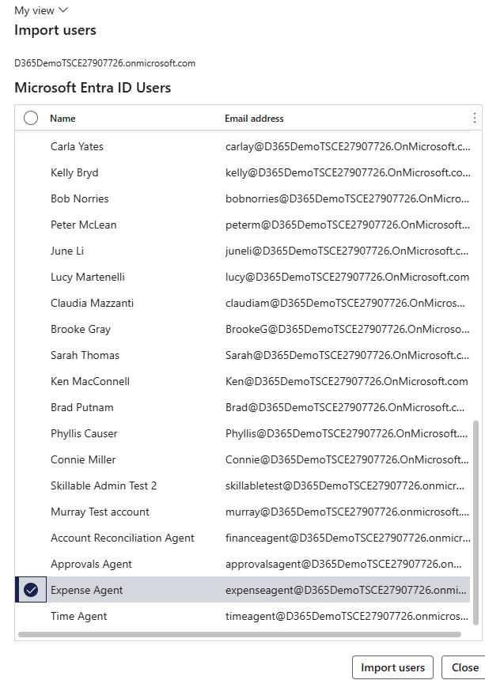
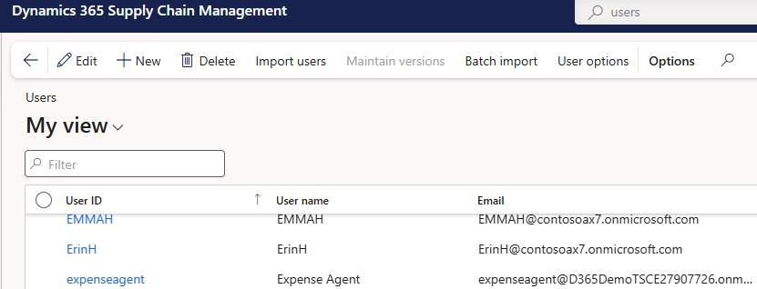
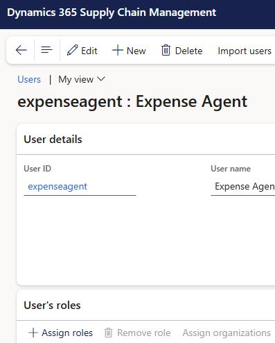
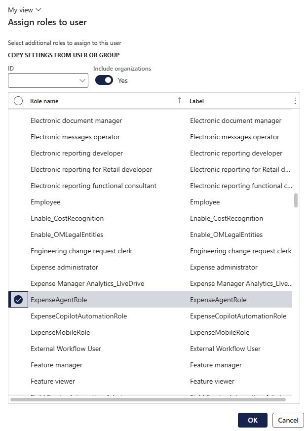
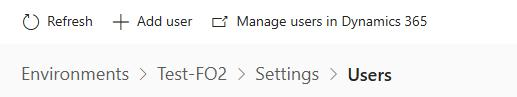
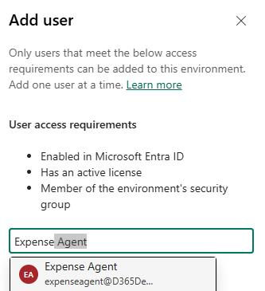
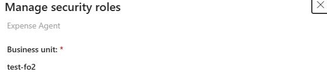
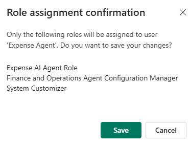

# Task 02: Assign roles to the agent identity
<!-- Estimated duration 5 minutes-->

## Introduction
Earlier in the lab you created an identity for the Expense agent. Now, you'll assign the roles required to the identity.

## Description

In this task, you'll add the **expenseagent** identity to resources and then assign roles.

## Success criteria

- The required identities and roles are assigned.

## Key tasks

### 01: Import the agent identity as a user and assign a role

1. In **Finance and Operations**, go to **System Administration** and select **Users**. 

    

1. On the menu bar, select **Import users**.

    

1. In the **Import users** pane, select **Expense Agent** and then select **Import users**.

    

1. Close the confirmation dialog.

1. In the list of users, locate and select **expenseagent**.

    

1. On the **User** page, in the **User's roles** section, select **+ Assign roles**.

    

1. In the **Assign roles to user** pane, select **ExpenseAgentRole**  and then select **OK**.

    

### 02: Add the **expenseagent** identity to the Power Platform admin center and assign roles

1. Open a browser tab and go to [Power Platform](https://admin.powerplatform.microsoft.com/).

1. Sign in by using the credentials for your demo environment.

    
    
1. In the left pane, select **Manage**. 

    

1. In the list of environments, select the **@lab.Variable(EnvName)** environment. 

    

1. On the **Access** tile, select **Users** and then select **See all**.

    

1. Select **+ Add user**.

    

1. In the **Add user** pane, search for and select +++**expenseagent&#64;@lab.Variable(Domain)**+++. Then, select **Add**.

    

1. On the **Manage security roles** pane, select the following three roles and then select **Save**:

    - Expense AI Agent Role
    - Finance and operations Agent Configuration Manager
    - System Customizer

    
    
    
    

    {: .note }
    > These roles provide access to Dataverse and Power Automate components that the agent needs to function

1. In the **Role assignment confirmation** dialog, select **Save**.

    