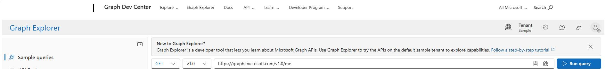
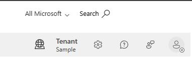
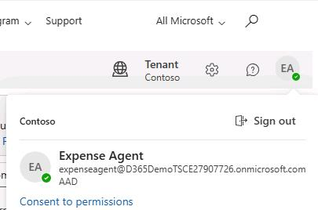
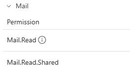

# Task 03: Configure the shared mailbox
<!-- Estimated duration 7 minutes-->

## Introduction
The Expense agent scans a mailbox folder every hour and stores the attachments as unattached receipts in Dynamics 365 Finance.

## Description

In this task, you create the shared mailbox for the Expense agent.

## Success criteria

- You receive an email from SAP that includes the URI and credentials to access the SAP Gateway Demo system.
- You successfully connect to the AP Gateway Demo system. 

## Learning resources

## Key tasks

### 01: Create the team

1. Open a browser tab and go to [Graph Explorer](https://developer.microsoft.com/en-us/graph/graph-explorer). 

    

1. At the upper right of the page, select **Sign in** (&#128100;).  

    

1. Sign in by using the following credentials:

    - **Username**: **expenseagent&#64;@lab.Variable(Domain)**
    - **Password**:  `ILIke@gents`

1. At the top right of the page, select the avatar for the account and then select **Consent to permissions**.

    

1. Scroll down and expand the **Mail** node. Locate the **Mail.Read.Shared** permission.

    

1. On the row for **Mail.Read.Shared**, select **Consent**.

    

1. In the **Permissions requested** dialog, select the **Consent on behalf of your organization** check box and then select **Accept**.

    