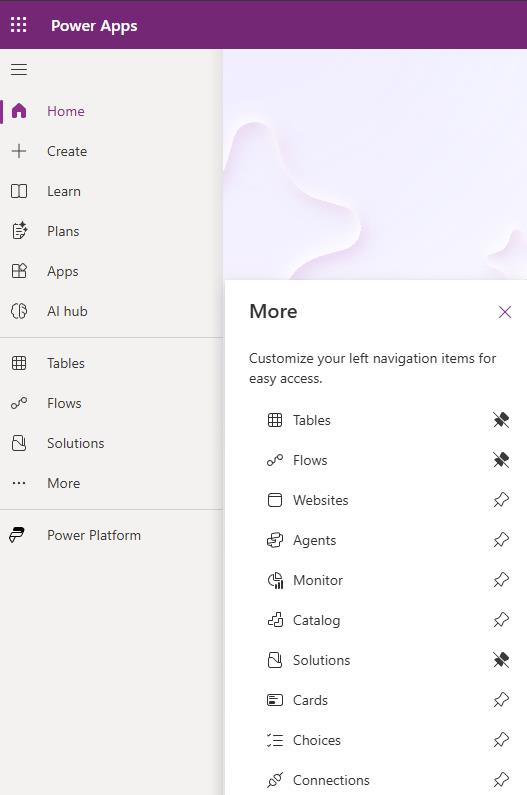
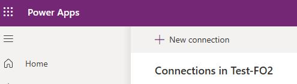
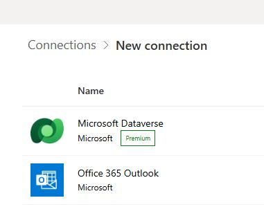

# Task 04: Create and configure connections
<!-- Estimated duration 10 minutes-->
## Introduction
To use the Expense agent, the agent must be able to communicate with other resources.

## Description

In this task, you create connections to the required resources.

## Success criteria

- You've created the required connections. 

## Learning resources
- [Create the required connections](https://learn.microsoft.com/en-us/dynamics365/project-operations/expense/expense-agent-setup#option-a-use-a-powershell-script-recommended "Create the required connections")

## Key tasks

### 01: Create connections

1. Open a browser tab and go to the [Power Apps maker portal](https://make.powerapps.com).

2. If prompted, sign in by using the admin credentials for your demo environment.

3. On the menu bar, select the **@lab.Variable(EnvName)** environment.

4. In the left pane, select **Connections**.

    {: .note }
    > You may need to select **More** to see the **Connections** option.

    

5. Select **+ New connection**.

    

6. Search for and select **Office 365 Outlook**. Then, select **Create**.

    

7. In the **Pick an account** dialog, select **expenseagent&#64;@lab.Variable(Domain)**.

    {: .note }
    > If **expenseagent&#64;@lab.Variable(Domain)** is not listed, select **+ Use another account** and then sign in by using the following credentials:
    >
    > - **Username**: **expenseagent&#64;@lab.Variable(Domain)**
    > - **Password**:  `ILIke@gents`

9. Repeat steps 5-8 to create a connection to the following connections:

    - Office 365 Users
    - Microsoft Dataverse
    - Microsoft Copilot Studio (preview)
    
    {: .warning }
    >  You already created a connection to Dataverse when you configured the Supplier Communications agent.
    >
    > It's important that you create a new connection for the Expense agent using **expenseagent&#64;@lab.Variable(Domain)**.
