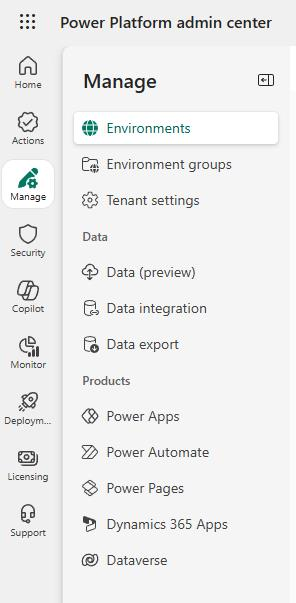
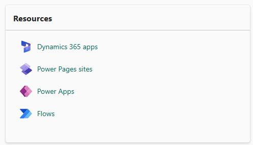
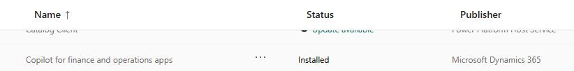
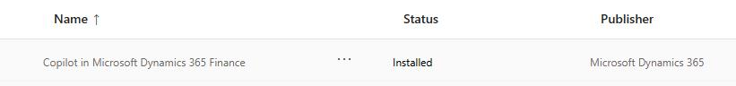

# Task 03: Update Copilot agent packages
<!-- Estimated duration 5 minutes-->

## Introduction
All Microsoft apps and services are updated regularly. You want to ensure that all resources required to support the demo use cases are up to date.

## Description

In this task, you'll check to see if key services required for the demo use cases are up to date. you'll update services as necessary.

## Success criteria

- All required services are up to date

## Learning resources

- [Enable Copilot capabilities in finance and operations apps](https://learn.microsoft.com/en-us/dynamics365/fin-ops-core/dev-itpro/copilot/enable-copilot "Enable Copilot capabilities in finance and operations apps")

## Key tasks

### 01: Update Copilot agent packages

1. If you closed Power Platform admin center, open a browser tab and go to [Power Platform](https://admin.powerplatform.microsoft.com/).

1. If prompted, sign in by using the admin credentials for your demo environment.

1. In the left pane, select **Manage**. 

    

1. In the list of environments, select the **@lab.Variable(EnvName)** environment. 

    

1. On the **Resources** tile, select **Dynamics 365** apps.

    

1. Locate the **Copilot for finance and operations apps** record.

    

1. Check the value for the **Status** column. If the value is **Installed**, the app is up to date. If the value is **Update available**, select the **Update available** link and follow any steps to acquire the updated content.

1. Repeat steps **6** and **7** to install and update the following app:

   -  **Copilot in Microsoft 365 Finance**
    
    