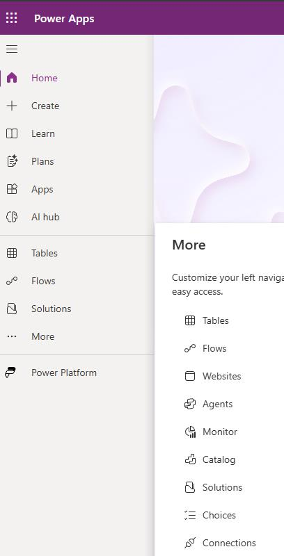
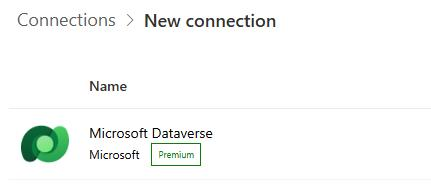
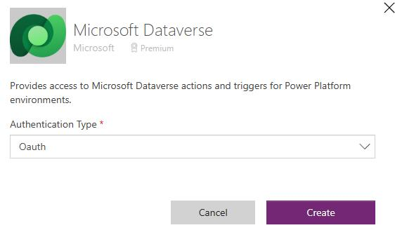
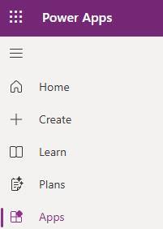
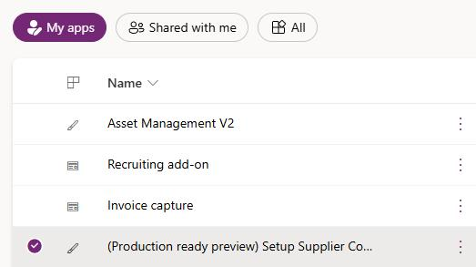
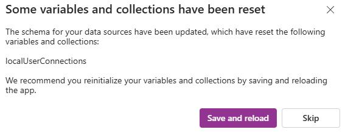
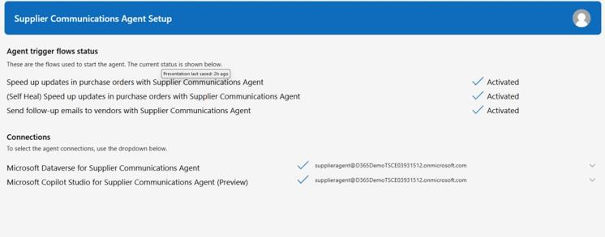

# Task 04: Create and configure connections
<!-- Estimated duration 10 minutes-->

## Introduction
To use the Account Reconciliation agent, the agent must be able to communicate with Dataverse and Copilot Studio.

## Description

In this task, you create connections to the required resources.

## Success criteria

- You've created the required connections. 

## Learning resources
- [Create the required connections](https://learn.microsoft.com/en-us/dynamics365/supply-chain/procurement/supplier-com-agent-setup?source=recommendations#create-the-required-connections "Create the required connections")

## Key tasks

### 01: Create connections

1. Open a browser tab and go to the [Power Apps maker portal](https://make.powerapps.com).

1. If prompted, sign in by using the admin credentials for your demo environment.

1. On the menu bar, select the **@lab.Variable(EnvName)** environment.

    

1. In the left pane, select **Connections**.

    {: .note }
    > You may need to select **More** to see the **Connections** option.

    

1. Verify that the following connections are displayed:

    - Microsoft Dataverse
    - Microsoft Copilot Studio

    {: .warning }
    > If you completed Exercise 03, these connections should be present. If you see both connections, skip to part 02 of this task.

1. Select **+ New connection**.

    

1. Search for and select +++**Microsoft Dataverse**+++.

    

1. In the **Authentication Type** field, select **OAuth** and then select **Create**.

    

1. In the authentication dialog, select the **expenseagent@D365DemoTSCExxx.onmicrosoft.com** identity and then sign in.

    {: .warning }
    > You'll likely need to select **+Use another account** in the **Pick an account** dialog so that you can add the identity.

1. Repeat steps 4-8 to create a connection to **Microsoft Copilot Studio**.

    
### 02: Update connection references

1. In the left pane, select **Apps**.

    

1. Locate and select the **(Production ready preview) Setup Supplier Communications** app.

    

1. On the menu bar, select **Play** (the right-facing triangle) to run the app.

1. In the confirmation dialog, select **Save and reload**.

    

1. In the **Setup** dialog, in the **Microsoft Dataverse for Supplier Communications Agent** field, select the **Microsoft Dataverse** connection that you created in part 01 of this task.

1. In the **Microsoft Copilot Studio for Supplier Communications Agent (Preview)** field, select the **Microsoft Copilot Studio** connection that you created in Part 01.

    

1. Select **Apply**.

1. Confirm that all connection references and connections have been activated.