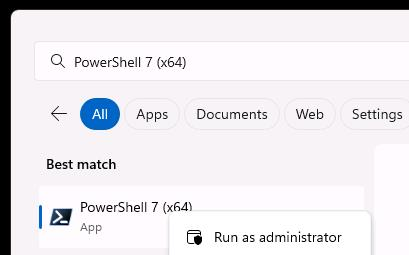
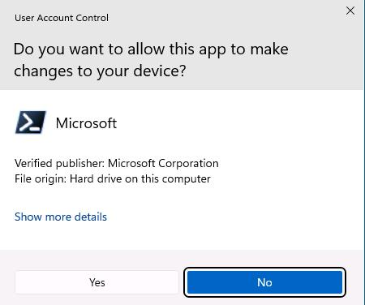
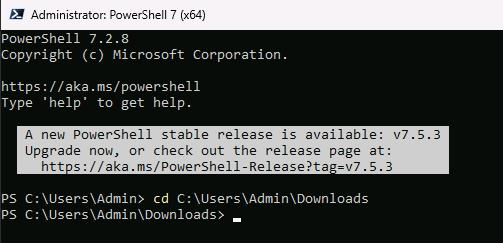
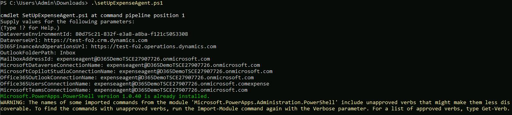
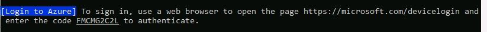
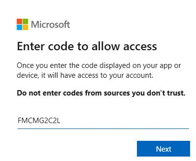
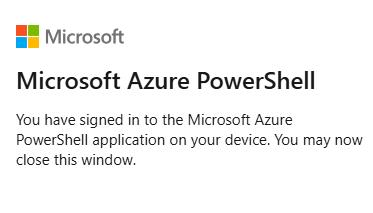

# Task 05: Run the installation script for the Account Reconciliation agent

## Introduction
To configure the Account Reconciliation agent you must perform a large number of steps in a specific order. To simplify the process, instead of manually performing the steps, you'll run a Windows PowerShell script that automates all of the steps. 


The script performs the following activities on your behalf:

- Set environment variables
- Verify and link connection references
- Enable Power Automate flows
- Publish the required Copilot agents
- Publish the Dataverse solution

## Description

In this task, you'll configure and then run a PowerShell script to set up the Expense agent.

## Success criteria

The PowerShell deployment script completes successfully.

## Learning resources
- [Set up the Account Reconciliation agent](https://learn.microsoft.com/en-us/dynamics365/finance/general-ledger/configure-acct-recon-agent "Set up the Account Reconciliation agent")


## Key tasks

### 01: Run the installation script for the Account Reconciliation agent

1. On the local machine taskbar, search for **PowerShell 7 (x64)**.

    

1. Right-click **PowerShell 7 (x64)** and then select **Run as administrator**.

    

1. In the **User Account Control** dialog, select **Yes**.

    

1. In the PowerShell window, enter the following command at the command prompt and then select **Enter**. This command switches you to the folder that contains the installation script.

    ```
    cd C:\Users\Admin\Downloads
    ```

    

1. In the PowerShell window, enter the following command at the command prompt and then select **Enter**. This command runs the installation script 

    ```
    SetUpAccountReconciliationAgent.ps1
    ```
    
1. When the script begins, you'll be prompted to enter values for four parameters. In the PowerShell window, enter the following values when you're prompted:

    - **DataverseEnvironmentID**: `@lab.Variable(EnvID)`
    - **DataverseURL**: `https://@lab.Variable(EnvURL)` 
    - **MicrosoftDataverseConnectionName**: `expenseagent&#64;@lab.Variable(Domain)`
    - **MicrosoftCopilotStudioConnectionName**: `expenseagent&#64;@lab.Variable(Domain)`


    {: .note }
    > After entering the values provided, wait while the script installs prerequisite packages.

    
    
1. When prompted, follow the on screen instructions to sign in to Azure by using the admin credentials for your demo environment:

    
    
    
1. In the **Enter code to allow access** dialog, enter the code from the PowerShell window and then select **Next**:

    

1. In the **Pick an account** dialog, select the admin credential for your demo environment.

1. In the confirmation dialog that displays, select **Continue**.

    

1. Close the web page and return to the PowerShell window.

    
